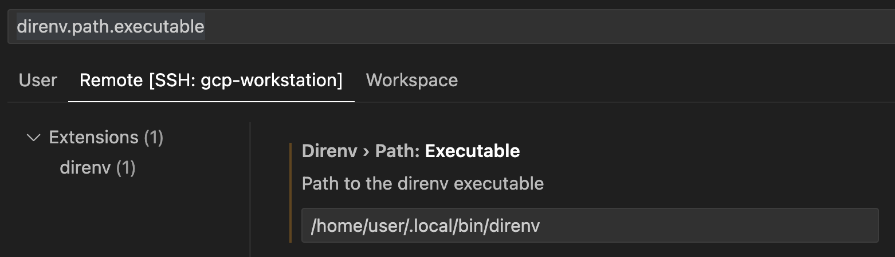

# C3 Standards

> [!IMPORTANT]
> `c3-e/c3standards` is a template repository that needs to be integrated into your team's repository (example `c3base`).
> Please ensure you run all scripts here in your git repository and not in `c3standards`.

The `c3standards` repository serves as a centralized hub to distribute setup scripts, linting configurations, auto-formatters and pre-commit hooks to enforce coding standards across all c3 repositories.

The linting rules follow the coding standards set in the [c3guidelines](https://github.com/c3-e/c3guidelines/blob/master/README.md) repository.

See the [Integrating c3standards into your repository](#integrating-c3standards-into-your-repository) section for more info on how to integrate and stay in-sync with the `c3standards` repository.

> [!TIP]
> TL;Dr: To update your current tools if already set up, run the following commands:
>
> GCP Workstation / Linux / Mac:
> ```shell
> cd setup
> make install
> ```
> Windows:
> ```shell
> npm install
> ```

## Table of Contents

* [Integrating c3standards into your repository](#integrating-c3standards-into-your-repository)
* [Installing code standards tools for local development](#installing-code-standards-tools-for-local-development)
* [Auto-fixing linting issues](#auto-fixing-linting-issues)
* [Linting](#linting)
  * [ECMAScript linting](#ecmascript-linting)
  * [Python linting](#python-linting)

## Integrating c3standards into your repository

Each repository administrator is responsible for integrating and keeping up-to-date with the `c3standards` repository.

### Who Should Follow This Section?

* Repository administrators responsible for the integration and maintenance of c3standards.

### When to Follow This Section?

* When a new repository is being set up.
* When an existing repository needs to implement c3standards.
* When there are updates to c3standards.

### Pre-Integration Steps

Before integrating `c3standards`, it is recommended to save your existing linting customizations and remove all linting and pre-commit hooks from your repository. This process involves removing the following files and directories:

* `.eslintrc`
* `.pylintrc`
* `linting/`
* `node_modules/`
* `package.json`
* `package-lock.json`
* `pre-commit-config.yaml`
* `scripts/`

You can reintroduce any custom rules on top of those provided by `c3standards` after the integration is complete into your repository.

### Integration Process

To integrate `c3standards` into your repository or to update your repository with latest tooling updates, follow these steps:

1. **Add `c3standards` as a Remote Repository:**

    ```shell
    git remote add c3standards git@github.com:c3-e/c3standards.git
    git fetch --all
    ```

2. **Merge `c3standards` into Your Repository:**

    ```shell
    git merge c3standards/master --allow-unrelated-histories --squash
    ```

    This command squashes and merges all changes from `c3standards` into your current repository. Ensure all conflicts are resolved. *If prompted to run `direnv allow`, do so after installing the tools.*

3. **Configure `package.json`:**
    After merging, edit the `package.json` file to match your repository's requirements (e.g., package name, description). *Make sure to delete the `node_modules` folder and the `package-lock.json` file.*

4. **Configure auto-update cadence**

    The `c3standards` repository comes with auto-upgrade capabilities to ensure repository administrators do no have to repeatedly merge in `c3standards` to get new updates.

    4.1. **Add automation token to GitHub repository**

    The auto-upgrade script requires a GitHub token to commit new changes into your repository. Go to *Settings > (Security) Secrets and variables > Actions* and create a new **repository secret** called `AUTOMATION_GITHUB_TOKEN` and store a [classic personal access token](https://docs.github.com/en/authentication/keeping-your-account-and-data-secure/managing-your-personal-access-tokens#creating-a-personal-access-token-classic) that has write permissions to your repository.

    4.2. **Configure auto-upgrade frequency**

    In `.github/workflows/c3standards-upgrader.yml`:
    * Update the cron-schedule with the frequency with which you'd like to update the c3standards tools in your repository.
    * (Optional) Set the `target_branch` into which you would like the c3standards upgrade patch changes are merged. The default value is `develop` and this value should generally not change.
    * (Optional) Configure `always_create_pr` to control whether the upgrader should always create a PR - even when a upgrade patch is successful. The default value is `false` and successful patch changes are merged automatically into the target branch.

5. **Install Code Standards Tools:**
    Follow the instructions in the [Installing Code Standards Tools for Local Development](#installing-code-standards-tools-for-local-development) section before proceeding to the next step.

6. **Customize Jarvis Build Configurations:**
    Set the Jarvis build configurations in the [config.js](.jarvis/steps/config/config.js) file based on the needs of your repository. Following is a quick-start checklist for setting these configurations:

    * Set `backupSourceControlTokens` to ensure results are reported correctly
    * (Optional) Customize `maxCodeAnalyzerCommentCount` and `storeResultBranches` based on your team's preferences
    * If configuring for a base repository:
      * Set `reportResultsToCodeAnalytics` to true
    * If configuring for a customer repository:
      * Set `topLevelCustomerPackage` to package being deployed the customer environment
      * Set `customerPackages` to list all packages defined in a customer repository
      * If you would like to send these results for analysis, set `reportResultsToCodeAnalytics` to true

7. **Commit Changes:**
    Once the installation is complete and all configurations are set, commit the changes to your branch and follow up by merging your code into your mainline development branch:

    ```shell
    git add .
    git commit -m "Merge c3standards into current repository"
    ```

8. **Enable C3 AI Code Analyzer in Jarvis:**
    With all the infrastructure for coding standards in place, the final step is to enable continuous monitoring of the health of the repository by enabling the C3 AI Code Analyzer in C3 AI Release Management. The C3 AI Code Analyzer will perform static code analysis on your code changes and provide automated code reviews on your pull requests.

    You will need access to your Studio's `jarvisservice` to perform these steps.

    First, get the id of your repository in Jarvis by running `JarvisService.GitRepository.fetch()`.

    Next, enable the Jarvis steps by running, where `<repoId>` is the id of your repository retrieved from the previous step:

    ```js
    JarvisService.GitRepository.make(<repoId>)
                               .withJarvisFilePath(`.jarvis/steps`)
                               .merge()
    ```

By following these steps, you ensure that `c3standards` is seamlessly integrated into your repository, keeping it up-to-date with the latest standards and practices.

## Installing code standards tools for local development

**Who Should Follow This Section?**

* Every contributor to the repository.

**When to Follow This Section?**

* The first time someone wants to contribute to the repository.
* Whenever an admin updates the toolset from `c3standards`.

After a repository is set up with code standards tooling, each developer needs to setup their local environment. This tooling setup is handled
through Ansible, a cross-platform automation tool.

### Initial Setup

#### 0. Create a GitHub token with access to repositories and packages (one time setup for all Operating Systems)

Some of C3 AI custom tools are hosted in the GitHub npm registry for the `@c3-e` organization. For this purpose, the automation script adds a custom npm registry for the `@c3-e` namespace with
your access token. The token can be generated by following the steps:

* Create a classic personal access token on [GitHub](https://docs.github.com/en/authentication/keeping-your-account-and-data-secure/managing-your-personal-access-tokens#creating-a-personal-access-token-classic)
* Grant the `read:packages` scope (required)
* Copy the token and store it in a safe location
* Make sure you [authorize the personal access token for use with SAML single sign-on](https://docs.github.com/en/enterprise-cloud@latest/authentication/authenticating-with-saml-single-sign-on/authorizing-a-personal-access-token-for-use-with-saml-single-sign-on)

#### 0.1. Remove global npm installations of linting packages

Run `npm list -g` to see the list of globally installed npm packages. Please uninstall the following packages if they already exist by running `npm uninstall -g <package_name>`:

- `@c3-e/eslint-plugin`
- `eslint-plugin`
- `prettier`
- `eslint`

#### 0.2 Cleanup any legacy npm configs

If `legacy-peer-deps` is set to true, delete it.

```sh
npm config get legacy-peer-deps
```

If it's set to `true`, run the following:

```sh
npm config delete legacy-peer-deps
```

### Installation on GCP Workstation

#### 1. Ensure pre-requisites are met for GCP Workstation

Please ensure step 0 is completed.

#### 2. Run the workstation setup script

Running the `workstation` setup script will install and set up the following tools:

* `ansible`: This is the tool that is used to run the end-to-end setup scripts
* `@c3-e npm registry`: This is where all npm packages related to code standards like the `eslint-plugin` are hosted
* `direnv`: Manages the command line environment variables for node version, conda version, etc. so that all users have identical development environments
* `node` and `npm`: These are used to run eslint and to setup the pre-commit hook
* `conda` and `python3`: These are used to run pylint

The setup script can be run by running the following commands on the terminal:

```sh
cd setup
make workstation
```

* When prompted `Do you want to use a custom, self-managed conda environment? Select (no) to automatically setup. (yes/no):`
  * Enter `no` to let the script automatically setup conda and an environment
  * Enter `yes` to manage your own conda setup and installation (Warning: choosing this option will lead to no conda support by the c3Standards team)
    * Ensure you already have conda installed and available in your PATH variable
    * Ensure you have activated a conda environment that can run `python 3.9` and later
* When prompted to `Enter your GitHub token to registry the @c3-e npm scope (leave blank and hit enter to skip):`
  * Please enter your GitHub token generated to read packages if you want to either setup your token for the first time or to update your token if it's expired
  * If there is no change in your token, just hit "enter" and the initial npm registry setup will be skipped

#### 3. Install the direnv extension in the workstation VSCode

VSCE terminal doesn't support getting `direnv` to work automatically. So, optionally install the `direnv` [extension](https://marketplace.visualstudio.com/items?itemName=mkhl.direnv)
on the workstation VSCode. When you then open the repository in a new window, `direnv` will work and all variables will be loaded automatically in your VSCode terminal.

If you see an error saying "direnv: command not found" in your VSCode using the direnv extension, click on the "Configure" button and change the "Path to the direnv executable" to:

```sh
/home/user/.local/bin/direnv
```



If you do not want to install the `direnv` extension, ensure to run the following commands everytime you cd to a new repository's root directory:

```sh
source ~/.bashrc
direnv allow
source ~/.bashrc
```

#### 4. Run the install script

Running the `install` script will install / update the `pre-commit hook` that ensures all code standards are followed for all staged code files while they are committed to git

Run the install script by running the following commands on the terminal:

```sh
cd setup
make install
```

The above command can be run frequently to ensure all tools are up-to-date.

### Installation on Linux / MacOS

#### 1. Ensure pre-requisites are met

Please ensure step 0 is completed.

For MacOS only, ensure to install [homebrew](https://brew.sh/).

#### 2. Install Ansible

Ansible can be installed by following their [installation documentation](https://docs.ansible.com/ansible/latest/installation_guide/intro_installation.html#installing-and-upgrading-ansible-with-pip). Ensure that the version of Ansible is `2.15.x` or later and is installed with `pip` and NOT `pipx` due to a [known issue on MacOS](https://github.com/ansible/ansible/issues/82535).
After ansible is setup, ensure you can access the command-line tool in your terminal by running:

```shell
ansible --version
```

#### 3. Run the setup script

Running the `setup` script will install and set up the following tools:

* `@c3-e npm registry`: This is where all npm packages related to code standards like the `eslint-plugin` are hosted
* `direnv`: Manages the command line environment variables for node version, conda version, etc. so that all users have identical development environments
* `node` and `npm`: These are used to run eslint and to setup the pre-commit hook
* `conda` and `python3`: These are used to run pylint

The setup script can be run by running the following commands on the terminal:

```sh
cd setup
make setup
```

* Note that this step requires you to enter your user password for super user permissions for tasks that require it.
* When prompted `Do you want to use a custom, self-managed conda environment? Select (no) to automatically setup. (yes/no):`
  * Enter `no` to let the script automatically setup conda and an environment
  * Enter `yes` to manage your own conda setup and installation (Warning: choosing this option will lead to no conda support by the c3Standards team)
    * Ensure you already have conda installed and available in your PATH variable
    * Ensure you have activated a conda environment that can run `python 3.9` and later
* When prompted to `Enter your GitHub token to registry the @c3-e npm scope (leave blank and hit enter to skip):`
  * Please enter your GitHub token generated to read packages if you want to either setup your token for the first time or to update your token if it's expired
  * If there is no change in your token, just hit "enter" and the initial npm registry setup will be skipped

#### 4. Restart terminal and allow direnv

After the ansible playbook runs successfully, just close your terminal and reopen it. When you `cd` to your repository's directory, enter the following:

```sh
direnv allow
```

This allows `direnv` to manage your development environment for your repository.

#### 5. Run the install script

Running the `install` script will install / update the `pre-commit hook` that ensures all code standards are followed for all staged code files while they are committed to git

Run the install script by running the following commands on the terminal:

```sh
cd setup
make install
```

The above command can be run frequently to ensure all tools are up-to-date.

### Installation on Windows

> [!IMPORTANT]
> The pre commit hook is currently only supported on WSL (Windows Subsystem for Linux) on windows. Some linters will not work on CMD / PowerShell, so proceed with caution.

#### 1. Ensure pre-requisites are met for Windows

Please ensure step 0 is completed.

#### 2. Install node and python3

Make sure to install atleast the mentioned versions of the following tools:

* node `v20.10.0`
* python `3.9` - easiest way is to download and install [miniconda](https://docs.conda.io/projects/miniconda/en/latest/index.html) for the corresponding version of python

#### 3. Add the c3-e npm registry

Run the following commands in a terminal with the right version of node:

```shell
npm config set "@c3-e:registry" https://npm.pkg.github.com
npm config set "//npm.pkg.github.com/:_authToken" "<insert your GitHub token here>"
```

#### 4. Install project dependencies

The final step is to run `npm install` in your repository (where the `package.json` exists) so it installs all required dependencies like `eslint, pylint`, the pre-commit hook and other tools.

* If auto-installation is failing, you can manually install pre-commit using these [instructions](https://pre-commit.com/index.html#installation) under the "as a 0-dependency zipapp" section:
    1. Download the `.pyz` file from the [GitHub Releases](https://github.com/pre-commit/pre-commit/releases) page
    2. Move the `.pyz` file into the root folder of the repository
    3. Run `python pre-commit-#.#.#.pyz install` and you should see the message `pre-commit installed at .git\hooks\pre-commit`

## Auto-fixing linting issues

After all the tools in `c3standards` are integrated, linting issues can be auto-fixed by following these steps:

1. **Run eslint:**
    To bulk-lint all ECMAScript files (js, jsx, ts, tsx) files in your repo, run:

    ```shell
    npm run prettier "**/*.{js,jsx,ts,tsx}"
    npm run lint:file:fix "**/*.{js,jsx,ts,tsx}"
    ```

2. **Run pylint:**
    To bulk-lint all python files in your repo, run:

    ```shell
    black . -l 120
    pylint "**/*.py"
    ```

3. **Stage files and run pre-commit hook:**
    After all files are linted, stage the files and run through the full pre-commit hook by running:

    ```shell
    git add .
    git commit -m "Auto-fix code quality issues"
    ```

4. **Commit all changes:**
    After running step 3, the pre-commit hook will show any code quality issues that were not auto-fixed. Commit all auto-fixed changes by running:

    ```shell
    git add .
    git commit -m "Auto-fix code quality issues" --no-verify
    ```

After the code quality issues are auto-fixed, it can be merged into your repository's development branch. All code quality issues that still exist will then be ready to be manually fixed.

## Linting

Linting ensures code consistency and adherence to coding standards, promoting cleaner, error-free, and more maintainable software development.
The `c3standards` repository includes

### ECMAScript linting

C3.ai uses a custom style guide for linting ECMAScript files (js, jsx, ts, tsx) documented in [c3guidelines](https://github.com/c3-e/c3guidelines) repository and tools like `prettier` and `eslint` to lint all relevant files. The custom rules are defined in the [@c3-e/eslint-plugin](https://github.com/c3-e/c3engineering/blob/develop/tools/eslint-plugin) package in the [style-guide](https://github.com/c3-e/c3engineering/blob/develop/tools/eslint-plugin/lib/configs/style-guide.js).

### Python linting

C3.ai follows the official Python style guide - [PEP 8](https://pep8.org/). We enforces PEP 8 standards through minor modifications to [pylint](https://pypi.org/project/pylint/) to accommodate the quirks of developing on the C3 AI Platform.

The linked `.pylintrc` file includes the following modifications to the original rules set by `pylint`:

* **Maximum line length**
  * Line width limit of 120 characters works better given that it is common to call C3 APIs with long names.
* **C3 namespace**
  * The `c3` variable is declared an in-build variable since all Types need to be accessed through this namespace that is resolved by the C3 AI Platform but not explicitly declared/imported in the file.
* **C3 enforced arguments**
  * Static and member functions declared on the `.c3typ` need to have `cls` and `this` to be the first argument by default. These arguments are generally not used in the function.
  * Similarly, developers might sometimes have to declare unused arguments since the methods are being overridden from a base class that declares it.
  * To ensure we don't get a false positive violation of the `unused-arguments` rule in these cases, the following argument names are ignored: `cls`, `this`, and any argument starting with an `_`.

The following `pylint` rules are disabled by default:

* **invalid-name**
  * Python file names are PascalCased similar to the C3 Type they accompany.
  * This rule is not applicable to C3.
* **import-outside-toplevel**
  * Python function implementations are intended to be self-contained with a specific `Action.Requirement`. If libraries import are written outside of a function, then another function in the same `.py` file may be broken if its `Action.Requirement` doesn't contain these libraries.
  * For this reason, the libraries are generally imported inside a function and not the top-level of the file.
  * This rule is not applicable to C3.
* **import-error**
  * `pylint` fails to find the imported libraries in a file because it is not executed in the same runtime as the functions would be.
  * This rule is not applicable to C3.
* **missing-function-docstring**
  * Functions declared on a Type are already documented on a `.c3typ` file. Only helper functions defined in the Python file need to be documented.
  * However, enforcing this rule would require Type System awareness which is not available in the pre-commit hook.
  * This rule is only applicable partially to C3 and will be enforced through automated PR reviews performed by our Code Analysis tool.
* **missing-module-docstring**
  * Modules are documented in the `.c3typ` file.
  * This rule is not applicable to C3.
* **no-member**
  * The `pylint` tool does not have context of the classes being imported from third-party libraries or from the C3 Type System. In either case, it cannot resolve member fields/functions through static analysis.
  * This rule is not applicable to C3.
* **attribute-defined-outside-init**
  * The `pylint` tool does not have context of the classes being imported from third-party libraries or from the C3 Type System. In either case, it cannot which attributes already belong to a class through static analysis.
  * This rule is not applicable to C3.
* **fixme**
  * All instances of `TODO` in an inline comment are caught under this rule. However, C3 processes allow the inclusion of `TODO`s that are accompanied by a ticket.
  * This rule does not conform to C3 processes.
